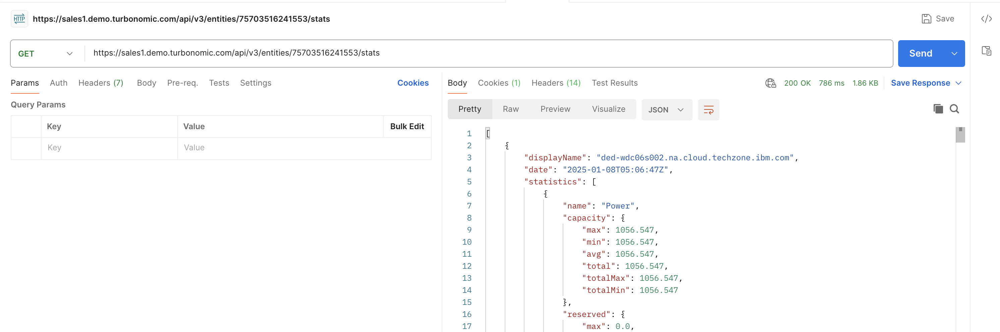
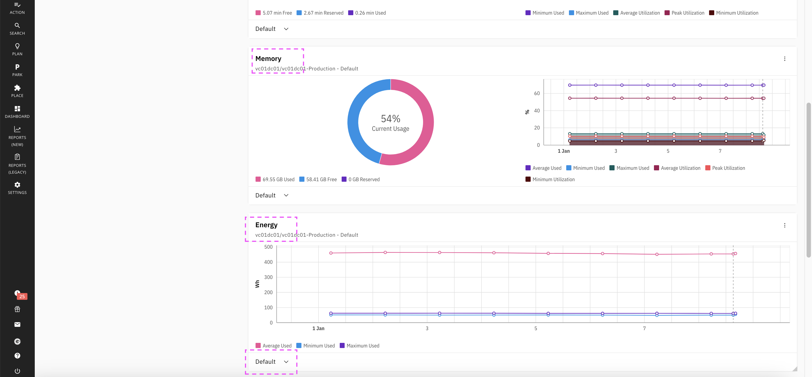

# Turbonomic and Envizi Integration - info

This document contains information about how to get the Engery and Carbon Foot print data available in Turbonoimc through APIs.


## 1. Turbonomic APIs

### 1.1 Login

URL : https://sales1.demo.turbonomic.com/api/v3/login?hateoas=true


#### CURL

```
curl --location 'https://sales1.demo.turbonomic.com/api/v3/login?hateoas=true' \
--header 'Cookie: JSESSIONID=node018kipht4j2vt81gsh6k21q42b928661.node0' \
--form 'username="myobserver"' \
--form 'password="xxxxxxx"'

```

### 1.2 Data Center

URL : https://sales1.demo.turbonomic.com/api/v3/search?types=DataCenter

Output file : <a target="_blank" href="./files/11-datacenter.json">Link</a>


#### CURL

```
curl --location 'https://sales1.demo.turbonomic.com/api/v3/search?types=DataCenter' \
--header 'Cookie: JSESSIONID=node018kipht4j2vt81gsh6k21q42b928661.node0'

```

### 1.3 Supplychains

URL : https://sales1.demo.turbonomic.com/api/v3/supplychains?environment_type=ONPREM&uuids=75703516241553

Output file : <a target="_blank" href="./files/21-supplychain.json">Link</a>


#### CURL

```
curl --location 'https://sales1.demo.turbonomic.com/api/v3/supplychains?environment_type=ONPREM&uuids=75703516241553' \
--header 'Cookie: JSESSIONID=node018kipht4j2vt81gsh6k21q42b928661.node0'

```

### 1.4 Entities

URL : https://sales1.demo.turbonomic.com/api/v3/entities/75703516241553/stats

Output file : <a target="_blank" href="./files/31-entities.json">Link</a>




#### CURL

```
curl --location 'https://sales1.demo.turbonomic.com/api/v3/entities/75703516241553/stats' \
--header 'Cookie: JSESSIONID=node018kipht4j2vt81gsh6k21q42b928661.node0'

```

## 2. Energy and Carbon FootPrint Details in Turbonomic

<details><summary>CLICK ME</summary>





</details>

## 3. Energy Data  in 2024

#### Turbonmoic Data


### Accessing via API

URL : https://sales1.demo.turbonomic.com/api/v3/entities/75703516408913/stats

Body: 
```
{
                    "startDate": "2024-01-01T00:00:01+00:00",
                    "endDate": "2025-01-07T23:59:59+00:00",
                    "statistics": [
                        {
                            "name": "Energy",
                            "filters": [
                                {
                                    "type": "relation",
                                    "value": "sold"
                                }
                            ]
                        }
                    ]
                }
```

Output file : <a target="_blank" href="./files/41-energy-1.json">Link</a>


#### CURL

```
curl --location 'https://sales1.demo.turbonomic.com/api/v3/entities/75703516408913/stats' \
--header 'Content-Type: application/json' \
--header 'Cookie: JSESSIONID=node018kipht4j2vt81gsh6k21q42b928661.node0' \
--data '{
                    "startDate": "2024-01-01T00:00:01+00:00",
                    "endDate": "2025-01-07T23:59:59+00:00",
                    "statistics": [
                        {
                            "name": "Energy",
                            "filters": [
                                {
                                    "type": "relation",
                                    "value": "sold"
                                }
                            ]
                        }
                    ]
                }'
```                

## 4. Carbon FootPrint in 2024

#### Turbonmoic Data


### Accessing via API

URL : https://sales1.demo.turbonomic.com/api/v3/entities/75703516408913/stats

Body: 
```
{
                    "startDate": "2024-01-01T00:00:01+00:00",
                    "endDate": "2025-01-07T23:59:59+00:00",
                    "statistics": [
                        {
                            "name": "CarbonFootprint",
                            "filters": [
                                {
                                    "type": "relation",
                                    "value": "sold"
                                }
                            ]
                        }
                    ]
                }
```

Output file : <a target="_blank" href="./files/42-carbon-footprint.json">Link</a>


#### CURL

```
curl --location 'https://sales1.demo.turbonomic.com/api/v3/entities/75703516408913/stats' \
--header 'Content-Type: application/json' \
--header 'Cookie: JSESSIONID=node018kipht4j2vt81gsh6k21q42b928661.node0' \
--data '{
                    "startDate": "2024-01-01T00:00:01+00:00",
                    "endDate": "2025-01-07T23:59:59+00:00",
                    "statistics": [
                        {
                            "name": "CarbonFootprint",
                            "filters": [
                                {
                                    "type": "relation",
                                    "value": "sold"
                                }
                            ]
                        }
                    ]
                }'

```                  